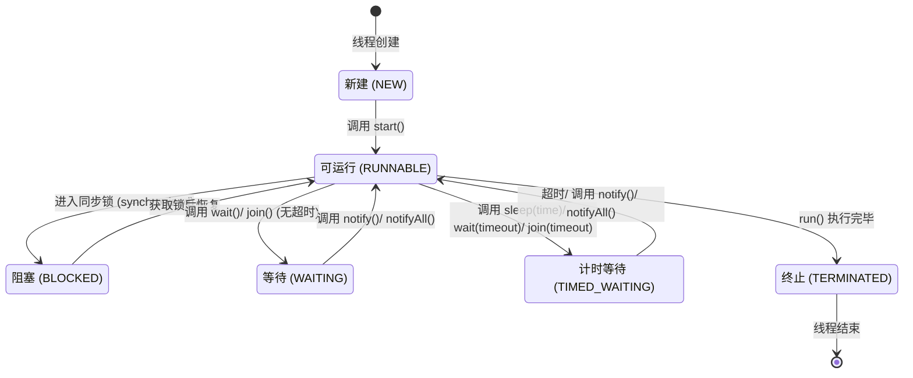
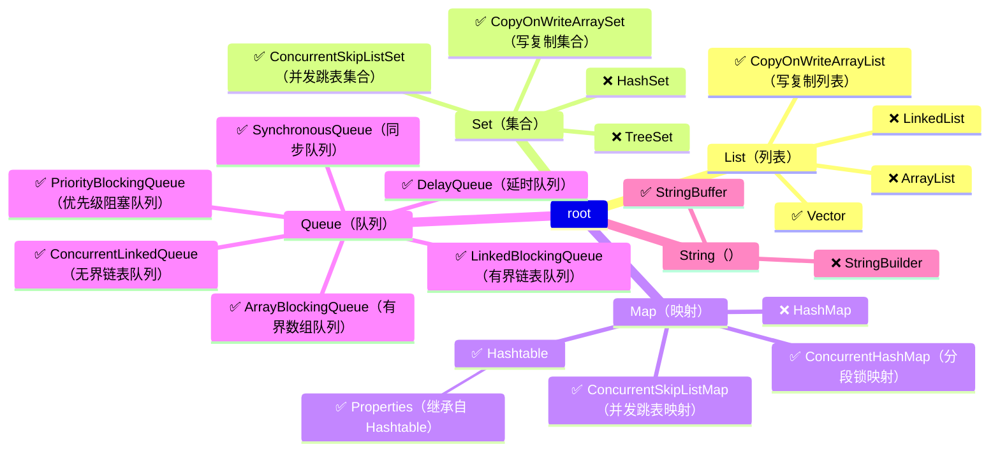

# Java多线程与并发编程 - 核心概念
> 你聊一聊多线程以及并发你是如何实现的，以往在实际工作中，遇到高并发的环境采用那些方案进行处理。
## 目标
- **基本概念 (Basic)**
- **多线程 (Thread)**
- [线程池 (Executor)](#线程池-executor)
- [并发容器 (Collections)](#并发容器-collections)
- [同步工具 (Tools)](#同步工具-tools)
- [原子对象 (Atomic)](#原子对象-atomic)

## 并发背后的故事

**什么是并发？**
并发就是指程序同时处理多个任务的能力。
并发编程的根源在于多任务情况下对资源访问的有效控制。

**你的程序在并发环境下一定是正确的吗？**
* [🐟代码小抄-并发统计App Store下载次数](https://codecopy.cn/post/c51tdh)

## 你必须知道的概念

**程序，进程与线程**

1. **程序**：程序是静态的概念，Windows下通常指`exe`文件。
2. **进程**：进程是动态的概念，当你双击一个程序，操作系统会把它加载到内存中运行，进程说明程序在内存中的边界。
3. **线程**：一个进程包含多个线程，线程是CPU调度的基本单位，每个线程都有自己的功能。

**并行与并发**

1. **🚗并行 (Parallelism)**：*多核CPU同时处理*
   * **就像多车道高速公路:** 多辆车可以同时在不同的车道上行驶，互不干扰。
   * **在计算机中:** 多个处理器或多核CPU同时执行多个任务，真正同时进行。

2. **🚚🚙🚗并发 (Concurrency)**：*单核CPU交替执行*
   * **就像单车道上的多辆车:** 虽然只有一条车道，但通过交替行驶，看起来像是同时前进。
   * **在计算机中:** 单个处理器通过快速切换任务，给人同时处理的错觉，实际是交替执行。

**同步和异步**

1. **⏳同步 (Sync)**：*按顺序执行，干等着*
   * **就像银行柜台办理业务：** 你去银行取钱，需要排队，前面的人不办完，你不能办。
   * **在编程中：** 代码按顺序执行，每个任务必须等前一个任务完成后才能执行下一个。

2. **🏃‍♂️异步 (Asyn)**：*不等了，先去忙别的，等有结果再回来处理*
   * **就像去餐厅点餐：** 你点完餐后不用等着，先去刷手机，等饭做好了，服务员再叫你来取。
   * **在编程中：** 代码遇到耗时操作（比如网络请求）时不会等，而是先去执行别的任务，等操作完成后再回来处理结果。

**临界区**

1. **🚧临时区：** *公共资源与共享数据，同一时间只能有一个线程访问*
   * **就像公司的打印机**：公司只有一台打印机（临界区），多个员工（线程）需要打印文件，每次只能一个员工使用。
   * **在编程中：** 临时区是指对共享资源访问的代码片段，通过互斥锁（Mutex），信号量（Semaphore），原子操作（Atomic Operations）来实现。

**死锁、饥饿、活锁**

1. **🛑死锁（Deadlock）：🔒**
   * **就像公路上堵车：** 谁也不让谁，大家都卡住
   * **在编程中：** 两个或多个线程互相持有对方需要的资源，导致无法继续执行。

2. **🍽️饥饿 (Starvation)：**
   * **就像奶茶店排队：** 总有人插队，有些人一直没机会买到奶茶。
   * **在编程中：** 线程本身是有执行优先级的，如果优先级低的线程一直无法获取到CPU执行权，就会一直处于等待状态。

3. **🔁活锁 (Livelock)：**
   * **就像礼让路口：** 你让我，我让你，谁也不走。
   * **在编程中：** 是指多个线程（进程）互相礼让，不断进行状态调整，但始终无法完成任务。

**线程安全**

1. **线程安全 (Thread-Safe)** 理解： 多线程环境下，对共享资源的访问不会引起数据不一致。
2. **线程安全三大特性**

   1. **🏗️原子性 (Atomicity)**：
      * **就像银行转账：** 要么扣钱和加钱都成功，要么都不成功。
      * **在编程中：** 一个或多个操作要么全部执行成功，要么全部不执行。

   2. **👀可见性 (Visibility)**：
      * **就像聊天室：** 你发的消息，其他人都能看到。
      * **在编程中：** 一个线程对共享变量的修改，其他线程能立即看到。

   3. **🔀有序性 (Ordering)**：程序执行的顺序按照代码的先后顺序执行。
      * **就像排队买票：** 先来的先买票，后来的后买票。
      * **在编程中：** 程序按照代码的先后顺序执行，不会乱序
        通过`volatile`，`synchronized`，`Lock`来实现线程安全。

## Java内存模型（JMM）

 [bilibili-磊哥-什么是Java内存模型（JMM）？](https://www.bilibili.com/video/BV1Cu4m1A7ha)

| **概念**                   | **作用**        | **比喻**      |
|--------------------------|---------------|-------------|
| **主内存（Main Memory）**     | 线程共享的内存       | 🏢 共享数据库    |
| **工作内存（Working Memory）** | 线程私有的内存       | 📖 每个人的小笔记本 |
| **volatile**             | 保证可见性、有序性     | 📢 共享公告     |
| **synchronized**         | 保证原子性、可见性、有序性 | 🔒 互斥锁      |
| **happens-before 规则**    | 规定线程间的执行顺序    | 📜 规则手册     |

## 创建线程的三种方式

* [🐟代码小抄-Java创建线程的三种方式](https://codecopy.cn/post/cq3kmh)
  1. **继承Thread类**
  1. **实现Runnable接口**
  1. **实现Callable接口**

## Synchronized线程同步机制

* [🐟代码小抄-Synchronized 三种使用场景](https://codecopy.cn/post/bxd0nq)，对应不同锁对象：
  1. **synchronized 代码块（锁定任意对象）**
  2. **synchronized 方法（锁定当前实例对象 this）**
  3. **synchronized 静态方法（锁定类的字节码对象 Class）**

## Java线程的6种状态

* [🐟代码小抄-Java线程的6种状态](https://codecopy.cn/post/s6z4y5)

## 死锁的产生

1. [🐟代码小抄-Java死锁的案例](https://codecopy.cn/post/udd9hm)

2. **死锁产生的原因：**
   * **说人话就是互掐资源：**
       * 你要用空调遥控器才把电视遥控器还我，我要用电视遥控器才把空调遥控器还你。结果俩人干瞪眼，谁都动不了。
   * **计算机中：**
       * 在多线程对公共资源（文件、数据）等进行操作时，彼此不释放自己的资源，而去试图操作其他线程的资源，而形成交叉引用，就会产生死锁。

3. **死锁的四个必要条件**（同时满足就死锁）：
   * **互斥条件**（Mutual Exclusion）：资源一次只能被一个线程占用，不能共享。
   * **占有并等待条件**（Hold and Wait）：线程拿着已有的资源不释放，但还想申请新资源。
   * **不可抢占条件**（No Preemption）：资源不能强行夺走，只能等占有者主动释放。
   * **循环等待条件**（Circular Wait）：线程之间形成环形依赖，每个线程都在等待下一个线程释放资源。

4. **解决死锁的建议：**
   * 减少对公共资源的占用，或一次性申请所需的所有资源
   * 用完资源及时释放，释放资源后再申请新资源
   * 减少`synchornized`的使用，采用“副本”方式替代。

## 重新认识线程安全（ThreadSafe）

  1. **线程安全定义**
        * 在拥有共享数据的多条线程并行执行的程序中，线程安全的代码会通过**同步机制**保证各个线程都可以正常且正确的执行，不会出现数据污染等意外情况。

2. **通过`synchornized`，`Lock`，`Atomic`等方式实现线程安全。**

3. **线程安全与不安全的区别**
   * **线程安全：**
       * 优点：可靠
       * 缺点：执行速度慢
       * 使用建议：在需要线程共享时使用
   * **线程不安全：**
       * 优点：速度快
       * 缺点：可能与预期不符
       * 使用建议：在线程内部使用，无需线程间共享时使用

## JUC并发工具

### 线程池（Executor）

1. **并发工具包：** （`java.util.concurrent`）
   在 Java 5 之前，我们只能使用 `synchronized`、`wait`、`notify` 等低级 API 来管理线程，代码复杂且容易出错。**从 Java 5 开始**，JDK 提供了 **`java.util.concurrent`** 并发工具包，帮我们更方便地处理线程、任务调度、数据共享等问题。

2. **💡什么是线程池**（Thread Pool）
      线程池（Thread Pool）是一种管理多个线程的技术，它通过**复用**已创建的线程来执行多个任务，避免了线程的**频繁创建和销毁**，从而提高系统性能。
   * **优点：**
       * 重用存在的线程，减少对象对象、消亡的开销
       * 线程总数可控，提高资源的利用率
       * 避免过多资源竞争，避免阻塞
       * 提供额外功能，定时执行、定期执行、监控等。

3. [🐟代码小抄-Executors线程池的4种创建方式](https://codecopy.cn/post/rpat5a)

   1. **可缓存线程池（`CachedThreadPool`）**
       * 特点：线程数动态伸缩，适合大量短任务（如日志处理、网络请求）。
   2. **定长线程池：`FixedThreadPool`**
      * 特点：线程数固定，适合长期稳定任务。
   3. **单线程池：`SingleThreadExecutor`**
      * 特点：单线程按顺序执行，适合日志、数据库操作等顺序任务。
   4. **调度线程池**：`ScheduledThreadPool`
      * 特点：定时或周期性任务，适用于心跳检测、定时任务。

4. **✅推荐自定义 `ThreadPoolExecutor`（避免 OOM）**
   * [bilibili-老齐-阿里为什么要禁用Java内置线程池？](https://www.bilibili.com/video/BV15m4y1o7gT)

### 同步工具 (Tools)

[🐟代码小抄-JUC同步工具实战：黑神话悟空开服场景](https://codecopy.cn/post/guuz4b)，理解使用场景，掌握API

1. **CountDownLatch（倒计时锁）**
   * 允许一个或多个线程等待**多个线程完成任务**后再继续执行。
   * 适用于 **并发初始化多个资源** 或 **多个任务完成后统一汇总**。

2. **Semaphore（信号量）**
   * **限制并发线程的数量**，控制资源的访问。
   * 适用于 **限流**、**连接池** 等场景。

3. **CyclicBarrier（循环屏障）**
   * 让多个线程**在某个时间点上同步执行**。
   * 适用于**所有线程都到达后才能继续执行**的场景。

4. **ReentrantLock（可重入锁）**
   * 重入锁是指任意线程在获取到锁之后,再次获取该锁而不会被该锁所阻塞。
   * ReentrantLock设计的目标是用来替代synchronized关键字。
   * [🐟代码小抄-ReentrantLock三大特性&扩展功能](https://codecopy.cn/post/ua7j1p)

**ReentrantLock 和 synchronized 的区别**

| 特征   | synchronized（==推荐==） | reentrantLock                |
| ---- | -------------------- | ---------------------------- |
| 底层原理 | JVM实现                | JDK实现                        |
| 性能区别 | 低->高（JDK5+）          | 高                            |
| 锁的释放 | 自动释放（编译器保证）          | 手动释放（finally保证）              |
| 编码程度 | 简单                   | 复杂                           |
| 锁的粒度 | 读写不区分                | 读锁、写锁                        |
| 高级功能 | 无                    | 公平锁、非公平锁唤醒Condition分组唤醒中断等待锁 |

5. **Condition（线程等待与唤醒）**
   * `Condition` 是和 `ReentrantLock` 搭配使用的 **等待/通知** 机制。
   * 设计的目标是用来替代传统的 `wait()`/`notify()`，但 **更灵活**，控制线程执行顺序！
   * [🐟代码小抄-Condition结合ReentrantLock的应用场景](https://codecopy.cn/post/gkuf8f)
   
6. [bilibili-老齐-CompletableFuture多线程编排实践](https://www.bilibili.com/video/BV1YUp2eKEpa)
	* [🐟代码小抄-CompletableFuture使用](https://codecopy.cn/post/4n2wwz)
	* [🤖CatGPT-CompletableFuture 多线程编排实践](https://chatgpt.com/canvas/shared/67b198f0b0d081918e2f53b6acd74052)
   1. **基本概念**： CompletableFuture 是 Java 8 引入的异步编程工具，扩展了 Future，支持链式回调、任务组合和异常处理。
      * 既实现了 `Future` 接口，又实现了 `CompletionStage` 接口。
      * 支持非阻塞式异步任务，提高系统吞吐量。
      * 提供丰富的任务组合方式，如串行执行、并行执行、结果合并等。
      * 提供异常处理机制，能够在任务失败时执行回退逻辑。
   2. **异步任务创建**：`supplyAsync()` 有返回值，`runAsync()` 无返回值。
      * `completedFuture()`：已完成，用于测试或默认值。
   3. **串行执行**：`thenApply()` 转换结果，`thenAccept()` 只消费，`thenRun()` 只执行任务。
   4. **并行组合**：`thenCombine()` 组合结果，`allOf()` 等待所有完成，`anyOf()` 选取最快的。
   5. **异常处理**：`exceptionally()` 处理异常默认值，`handle()` 处理异常并可返回新值，`whenComplete()` 记录异常但不改变结果。

### **并发容器 (Collections)**

**面试题：线程安全的类**

| **类别**         | **线程安全**                          | **线程不安全**                |
| -------------- | --------------------------------- | ------------------------ |
| **List**（列表）   | `Vector`                          | `ArrayList`、`LinkedList` |
| **Set**（集合）    | ❌（默认都不安全）                         | `HashSet`、`TreeSet`      |
| **Map**（映射）    | `Hashtable`                       | `HashMap`                |
| **Properties** | `Properties`（继承 `Hashtable`，线程安全） | ❌                        |
| **String**     | `StringBuffer`                    | `StringBuilder`          |

**JUC下线程安全的并发容器**

* `ArrayList` -> CopyOnWriteArrayList - 写复制列表
* `HashSet` -> CopyOnWriteArraySet - 写复制集合
* `HashMap` -> **ConcurrentHashMap** - 分段锁映射

### **原子对象 (Atomic)**

1. **原子性 (Atomicity)**：
   * **定义**：一个操作或多个操作要么全部执行，且执行的过程不会被任何因素打断，要么就都不执行。
2. [🐟代码小抄-乐观锁 vs 悲观锁](https://codecopy.cn/post/zgx6tt)
   * **乐观锁**：
     * 每次不加锁，而是假设没有冲突而去完成某项操作。如果因为冲突失败，就重试，直到成功。
   * **悲观锁**：
     * 假设最坏情况，独占资源，确保不会被其它线程修改。例如 `synchronized`，数据库 `select... for update`。
3. **`Atomic` 包**
   * 提供无锁（lock-free）的原子类，确保并发数据安全，适用于高并发场景。
   * **原理**：通过 `CAS`（Compare And Swap）操作，保证数据的原子性。
   * [🐟代码小抄-原子对象 (Atomic) 的使用](https://codecopy.cn/post/o904qw)

| **分类**    | **类名**                                                                        | **作用**                     |
| --------- | ----------------------------------------------------------------------------- | -------------------------- |
| **基本类型**  | `AtomicInteger`、`AtomicLong`、`AtomicBoolean`                                  | 提供基本类型的原子操作                |
| **数组类型**  | `AtomicIntegerArray`、`AtomicLongArray`                                        | 对数组元素进行原子更新                |
| **引用类型**  | `AtomicReference<T>`、`AtomicStampedReference<T>`、`AtomicMarkableReference<T>` | 适用于对象引用的原子更新，支持版本控制和标记     |
| **字段更新器** | `AtomicIntegerFieldUpdater`、`AtomicLongFieldUpdater`                          | 允许对 `volatile` 修饰的字段进行原子更新 |

4. **解决 ABA 问题**
   * 当变量从 `A → B → A` 变化，CAS 可能认为它未被修改，导致错误。
   * 解决方案：使用 `AtomicStampedReference` 记录版本号。
